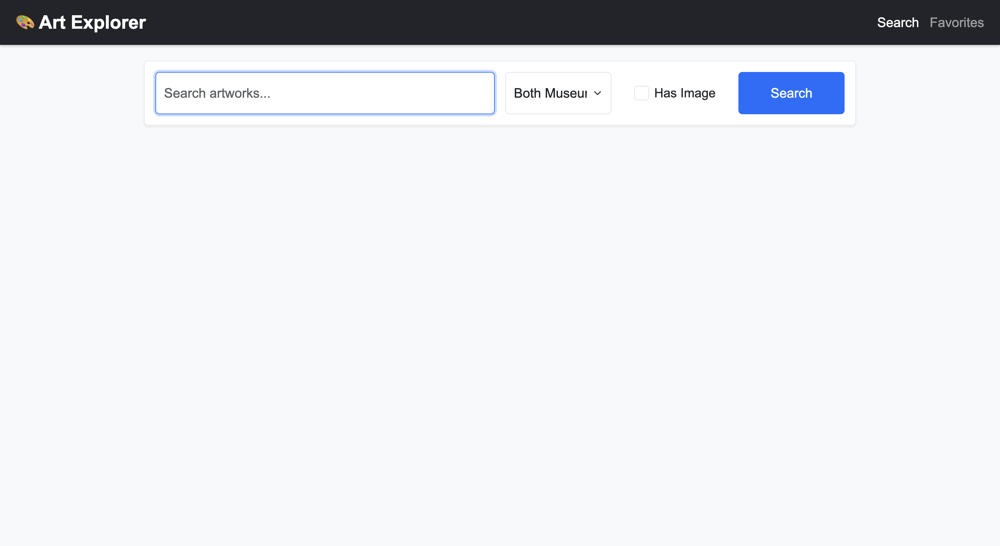
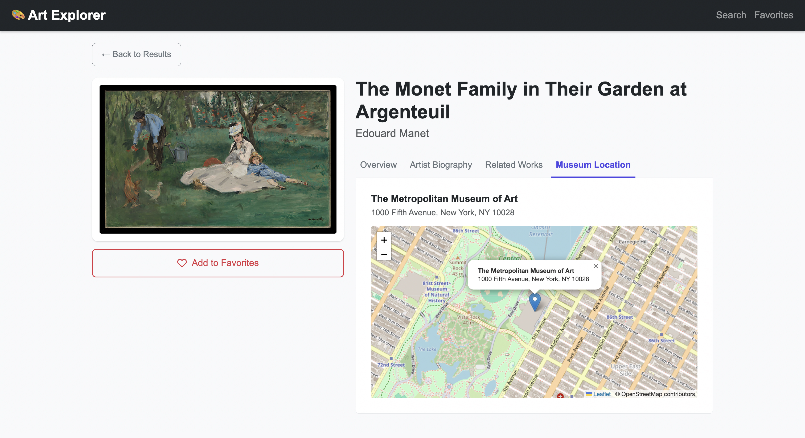
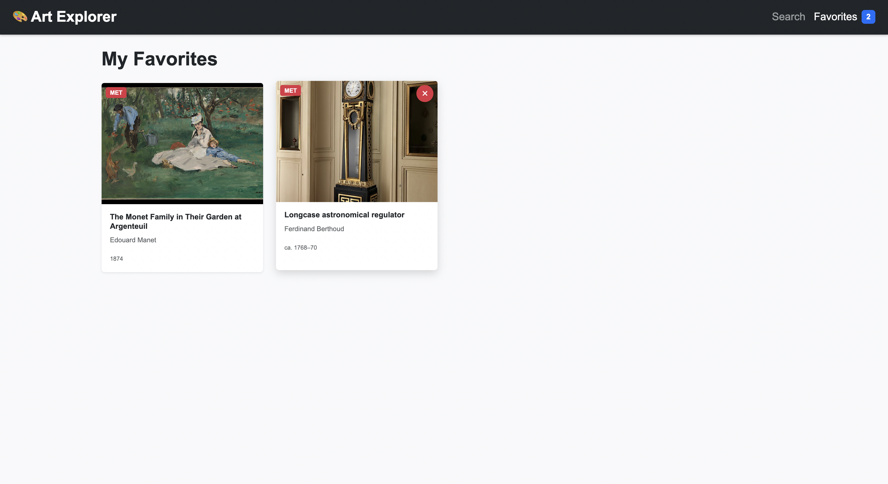

# 🎨 ArtSphere

A full-stack art discovery platform that brings collections from **The Metropolitan Museum of Art** and **Harvard Art Museums** into a unified search experience.

Built with **Node.js, Express.js, Bootstrap 5, Leaflet.js, REST APIs, Docker, and Google Cloud Run**, ArtSphere allows users to discover artworks, explore artist information, view museum locations, and save favorite pieces across browser sessions.

## 🚀 Live Demo

👉 **[Explore ArtSphere](https://art-explorer-704411817667.us-central1.run.app/)**

---

## 📌 About ArtSphere

**ArtSphere** provides a unified interface for discovering artworks across multiple museum collections.

Instead of requiring the frontend to communicate independently with different museum APIs, the application uses a **Node.js/Express backend as an API proxy**. The backend retrieves data from multiple external services, normalizes their different response formats, and returns a consistent representation to the frontend.

The application integrates:

* 🏛️ The Metropolitan Museum of Art API
* 🎓 Harvard Art Museums API
* 📚 Wikipedia API

Users can search across one or both museum collections, filter artworks, browse paginated results, explore detailed artwork and artist information, view museum locations on an interactive map, and save favorite artworks locally.

## ✨ Features

### 🔍 Unified Artwork Search

* Search across **The Metropolitan Museum of Art**
* Search across **Harvard Art Museums**
* Search both collections simultaneously
* Filter results by museum
* Filter artworks to show only items with images
* Debounced search-as-you-type
* Responsive artwork card grid
* Loading skeletons while retrieving results

### 📄 Pagination

* Server-side pagination
* Previous and Next navigation
* Current page indicator
* Unified pagination across museum data sources

### 🖼️ Artwork Details

View detailed information about individual artworks, including:

* Artwork image
* Title
* Artist
* Date
* Medium
* Dimensions
* Museum / department
* Link to the original museum collection

### 👨‍🎨 Artist Biography

Artist information is retrieved dynamically from the **Wikipedia API**.

Users can:

* Read a summary of the artist
* Access the full Wikipedia article
* Explore other works by the same artist

### ❤️ Persistent Favorites

Users can save artworks to a personal favorites collection.

Favorites are stored using **browser `localStorage`**, allowing them to persist across browser sessions without requiring a user account or database.

Users can:

* Add artworks to favorites
* View saved artworks
* Remove artworks from favorites
* Keep favorites after closing and reopening the browser

### 🗺️ Interactive Museum Maps

ArtSphere integrates **Leaflet.js** to display interactive maps for museum locations.

The application includes locations for:

* The Metropolitan Museum of Art — New York City
* Harvard Art Museums — Cambridge, Massachusetts

## 🛠️ Technologies Used

### Backend

* **Node.js**
* **Express.js**
* **node-fetch**
* **dotenv**
* RESTful API architecture

### Frontend

* **HTML5**
* **CSS3**
* **JavaScript**
* **Bootstrap 5**
* **Fetch API**
* **LocalStorage API**

### Maps

* **Leaflet.js**
* **OpenStreetMap**

### External APIs

* **Metropolitan Museum of Art Collection API**
* **Harvard Art Museums API**
* **Wikipedia REST API**

### Deployment

* **Docker**
* **Google Cloud Run**

## 🏗️ Application Architecture

```text
                         ┌──────────────────────────┐
                         │          User            │
                         └────────────┬─────────────┘
                                      │
                                      ▼
                         ┌──────────────────────────┐
                         │     Web Frontend         │
                         │ HTML / CSS / JavaScript  │
                         │      Bootstrap 5         │
                         └────────────┬─────────────┘
                                      │
                              Fetch / REST API
                                      │
                                      ▼
                         ┌──────────────────────────┐
                         │   Node.js + Express.js   │
                         │       API Proxy          │
                         └───────┬──────┬───────────┘
                                 │      │
                    ┌────────────┘      └────────────┐
                    ▼                                ▼
          ┌──────────────────┐             ┌──────────────────┐
          │ Met Museum API   │             │ Harvard Art      │
          │                  │             │ Museums API      │
          └──────────────────┘             └──────────────────┘
                    │                                │
                    └────────────┬───────────────────┘
                                 │
                                 ▼
                        Normalized Artwork Data

                                 │
                                 ▼
                      ┌─────────────────────┐
                      │   Wikipedia API     │
                      │ Artist Biographies  │
                      └─────────────────────┘
```

## 🔄 API Data Normalization

The Met Museum and Harvard Art Museums APIs return artwork information using different data structures.

ArtSphere's Express backend transforms responses from both APIs into a consistent format.

For example:

```json
{
  "id": "12345",
  "source": "met",
  "title": "Artwork Title",
  "artist": "Artist Name",
  "date": "1889",
  "medium": "Oil on canvas",
  "dimensions": "...",
  "imageUrl": "...",
  "museum": "The Metropolitan Museum of Art",
  "objectUrl": "..."
}
```

This allows the frontend to render artworks from different museums using the same UI components.

## ⚡ Performance & Reliability

The backend includes several optimizations for working with external museum APIs.

### In-Memory Caching

Frequently requested API responses are temporarily cached to reduce unnecessary requests to external services.

### Controlled Concurrency

Requests to the Met Museum API are processed with limited concurrency rather than sending a large burst of requests simultaneously.

This helps reduce the likelihood of triggering external API rate limits.

### Retry & Exponential Backoff

Failed or rate-limited upstream requests can be retried using exponential backoff.

The server also handles:

* API rate limits
* Network failures
* Request timeouts
* Invalid JSON responses
* Temporary upstream service failures

These mechanisms make the application more resilient when communicating with third-party APIs.

## 🔌 Backend API Endpoints

### Search Artworks

```http
GET /api/search
```

Supported query parameters:

```text
q          Search keyword
page       Page number
source     met | harvard | both
hasImage   true | false
```

Example:

```text
/api/search?q=monet&page=1&source=both&hasImage=true
```

### Artwork Details

```http
GET /api/artwork/:source/:id
```

Retrieves detailed information about a selected artwork.

### Artist Biography

```http
GET /api/artist/:name
```

Retrieves artist information from Wikipedia.

### Related Works

```http
GET /api/artist/:name/works
```

Retrieves additional works associated with an artist.

## 📁 Project Structure

```text
artsphere/
│
├── server.js
├── package.json
├── package-lock.json
├── Dockerfile
├── .gitignore
├── .env.example
├── README.md
│
├── public/
│   ├── index.html
│   │
│   ├── css/
│   │   └── styles.css
│   │
│   └── js/
│       ├── app.js
│       ├── api.js
│       ├── favorites.js
│       └── map.js
│
└── screenshots/
    ├── search.png
    ├── results.png
    ├── artwork-details.png
    ├── map.png
    └── favorites.png
```

## 🔐 Environment Variables

ArtSphere requires an API key for the **Harvard Art Museums API**.

Create a `.env` file in the project root:

```env
HARVARD_API_KEY=your_harvard_api_key
```

> [!IMPORTANT]
> Never commit your actual `.env` file or API key to GitHub.

For reference, you can create an `.env.example` file:

```env
HARVARD_API_KEY=your_harvard_api_key_here
```

## 💻 Running Locally

### 1. Clone the Repository

```bash
git clone https://github.com/YOUR-USERNAME/artsphere.git
```

### 2. Navigate to the Project

```bash
cd artsphere
```

### 3. Install Dependencies

```bash
npm install
```

### 4. Configure the Environment

Create a `.env` file:

```env
HARVARD_API_KEY=your_harvard_api_key
```

### 5. Start the Application

```bash
node server.js
```

Open your browser and visit:

```text
http://localhost:8080
```

## 🐳 Running with Docker

Build the Docker image:

```bash
docker build -t artsphere .
```

Run the container and provide the Harvard API key as an environment variable:

```bash
docker run -p 8080:8080 \
  -e HARVARD_API_KEY=your_harvard_api_key \
  artsphere
```

Then open:

```text
http://localhost:8080
```

## ☁️ Deployment

ArtSphere is containerized using **Docker** and deployed on **Google Cloud Run**.

The production Harvard API key is supplied through an environment variable rather than being included in the application's source code.

### 🌐 Live Application

👉 **[ArtSphere – Live Demo](https://art-explorer-704411817667.us-central1.run.app/)**

## 📸 Screenshots

### 🔍 Artwork Search



### 🖼️ Search Results


### 🎨 Artwork Details


### 🗺️ Museum Location



### ❤️ Favorites



## 💡 What I Learned

Through this project, I gained hands-on experience with:

* Architecting a full-stack application with Node.js and Express
* Building REST API proxy endpoints
* Integrating multiple third-party APIs
* Normalizing heterogeneous API responses
* Implementing server-side pagination
* Handling external API failures and rate limits
* Implementing retries and exponential backoff
* Controlling concurrent API requests
* Caching external API responses
* Protecting API credentials with environment variables
* Building responsive interfaces with Bootstrap 5
* Creating tabbed detail views
* Managing persistent client-side state with localStorage
* Integrating interactive maps with Leaflet.js
* Containerizing Node.js applications with Docker
* Deploying applications to Google Cloud Run

## 👤 Author

**YOUR NAME**

* **LinkedIn:** [LinkedIn Profile](https://www.linkedin.com/in/aryansindhu/)
* **GitHub:** [GitHub Profile](https://github.com/aryansindhu8/)

---

⭐ If you found this project interesting, feel free to star the repository.
